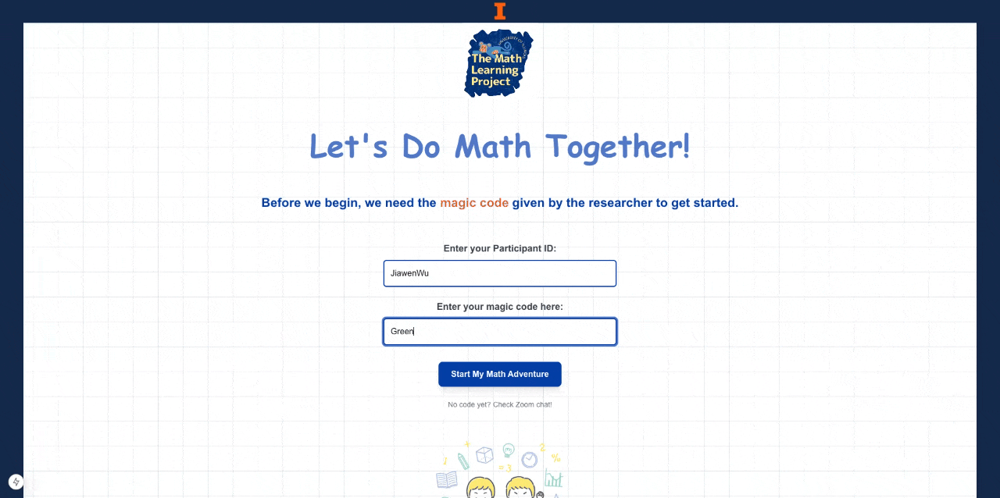

# TML Online Math Adventure

A Next.js‑based educational app designed to explore how different math‑learning contexts influence parent–child engagement and learning outcomes. Developed as part of my dissertation in educational psychology and technology-mediated learning.

---

## 🎯 Highlights

- **Experimentally structured**: Supports formal math, word problems, and interactive games with counterbalanced delivery.  
- **Choice manipulation**: Users select activity types, offering research‑driven autonomy dynamics.  
- **PWA & responsive**: Downloadable, works offline, and optimized for multiple devices.  
- **Full-stack architecture**: Frontend powered by Next.js; backend powered by AWS Amplify and DynamoDB.  
- **High-fidelity analytics**: Captures clickstreams, hint usage, timing, and completion data for research use.  

---

## 🔬 Motivation & Research Design

Built to serve research investigating:

- **Key question**: How do activity types and autonomy features affect parent–child math involvement and child learning?
- **Design**: Randomized controlled study with counterbalanced activity order and structured difficulty progression.
- **Target group**: Elementary students (grades 3–5).  
- **Data collected**: Accuracy, response time, hints used, activity preference, session duration—using behavioral logs for subsequent quantitative analyses.

---

## 📱 App Preview

Here's a visual glimpse of the interactive experience. GIFs show:
- *App demo in action*
- *One of the gameplay mechanics*

```markdown


```

---

## 🏗️ Technical Stack

| Layer | Technologies & Tools |
|-------|---------------------|
| Frontend | Next.js, TypeScript, Tailwind CSS, Framer Motion |
| Backend | AWS Amplify, DynamoDB, REST API |
| Analytics | Real-time logging, local storage fallback, event capture |
| UX Features | Mobile-first, accessibility-focused, PWA-ready |

---

## 🚀 Getting Started

### Prerequisites
- Node.js v18+
- npm or Yarn
- AWS account for Amplify configuration

### Install & Launch Locally
```bash
# Clone the repository
git clone https://github.com/jiawenwu27/TML-online-math-adventure.git
cd TML-online-math-adventure

# Install dependencies
npm install       # or yarn

# Configure environment
cp .env.example .env.local
# Provide AWS Amplify and DynamoDB credentials

# Run the app
npm run dev
```

Navigate to [http://localhost:3000](http://localhost:3000) to explore.

### Deploy to Production
```bash
npm run build
amplify push
```

---

## 📊 Research Workflow

1. **Session start**: Research assistant initiates baseline surveys and assessments.
2. **Activity session**: Participants complete five math task rounds with structured choice.
3. **Data captured**: Behavioral logs + post-session surveys.
4. **Analysis-ready**: Built-in export tools for statistical and qualitative examination.

---

## 🔮 Future Enhancements

- **Adaptive learning**: AI-driven difficulty adjustment.
- **Collaborative tasks**: Real-time parent–child interaction modules.
- **Mobile app**: React Native version.
- **Gamified learning**: Reward systems and progress badges.

---

## 💡 Why This Project Matters

- Demonstrates integration of experimental design into full-stack app development.
- Combines learning science theory with real-world engineering.

---

## 📄 License & Credits

Created by **Jiawen Wu**. For questions or collaboration interests, feel free to reach out or submit an issue.

---

## 📚 References (Contextual Research)

- Deci & Ryan (2000), Grolnick et al. (2002) – autonomy-support literature
- Wu et al. (2022) – parent–child daily interactions in math contexts
- Wu et al. (2024) – parent–child dynamics in math interaction  
- Patall et al. (2010), Berkowitz et al. (2015) – structured choice and playful learning effects

---

## 🤝 Contact & Collaboration

**Principal Investigator**: Jiawen Wu  
**Institution**: University of Illinois Urbana Champaign  
**Department**: Psychology Department  
**Email**: jiawenw5@illinois.edu  
**Research Interests**: Educational Technology, Mathematics Education, Learning Analytics, Experimental Design

---


